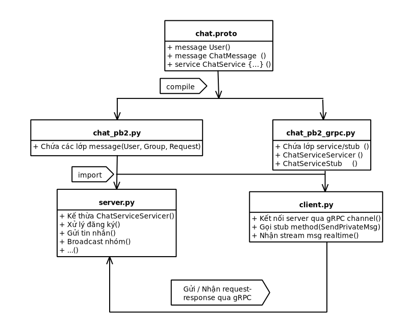

# 💬 Dự án: Hệ thống Ứng dụng Chat Nhóm Đa Người Dùng (Client-Server)

Đây là một dự án mô phỏng ứng dụng chat sử dụng kiến trúc **Client-Server**, cho phép nhiều người dùng kết nối, giao tiếp riêng tư (P2P) hoặc trò chuyện trong các nhóm công cộng/riêng tư. Hệ thống được thiết kế để xử lý việc đăng ký người dùng, quản lý nhóm và chuyển tiếp tin nhắn (forwarding) thông qua máy chủ trung tâm.

Công nghệ chính được sử dụng trong dự án này là **gRPC** để xây dựng giao thức giao tiếp hiệu quả giữa Client và Server, cùng với **Python** cho việc triển khai logic ứng dụng.

## Sơ đồ giao tiếp 


## ✨ Tính năng Nổi bật

| Danh mục | Tính năng Chi tiết |
| :--- | :--- |
| **Đăng ký & Tìm kiếm** | Cho phép Client kết nối, đăng ký (login) và tìm kiếm các người dùng khác đang online. |
| **Chat Riêng (P2P)** | User gửi tin nhắn riêng đến Server, Server chuyển tiếp (forward) tin nhắn đó đến User đích. |
| **Quản lý Nhóm** | User có thể **tạo**, **tham gia** và **rời** khỏi các nhóm chat. |
| **Chat Nhóm (Broadcast)** | User gửi tin nhắn nhóm đến Server, Server thực hiện **broadcast** tin nhắn tới tất cả thành viên trong nhóm. |
| **Lịch sử Chat** | Hỗ trợ xem lại lịch sử tin nhắn **riêng** và **nhóm** theo số lượng dòng yêu cầu. |
| **Giao diện Dễ dùng** | Giao diện dòng lệnh (CLI) trực quan với tập hợp các lệnh rõ ràng. |

---

## 🚀 Các Bước Khởi động

Để chạy chương trình, bạn cần thực hiện các bước sau trong môi trường Python:

1.  **Cài đặt Thư viện:** Đảm bảo rằng tất cả các thư viện cần thiết đã được cài đặt thông qua file `requirements.txt`.
    ```bash
    pip install -r requirements.txt
    ```

2.  **Khởi chạy Server:** Chạy chương trình máy chủ.
    ```bash
    python run_server.py
    ```

3.  **Khởi chạy Client:** Mở nhiều cửa sổ terminal mới và chạy chương trình Client để mô phỏng các người dùng khác nhau.
    ```bash
    python client.py
    ```

---

## ⌨️ Hướng dẫn Sử dụng (Client)

Sau khi khởi chạy Client và đăng nhập, bạn có thể sử dụng các lệnh sau:

| Lệnh | Mô tả |
| :--- | :--- |
| `search <tên>` | Tìm kiếm một người dùng theo tên. |
| `ul` | Xem danh sách tất cả người dùng (users) đang hoạt động. |
| `groups` | Xem danh sách tất cả các nhóm chat hiện có. |
| `sgroup` | Xem danh sách các nhóm mà bạn đã tham gia/tạo. |
| `gmem <group_id>` | Xem danh sách thành viên của một nhóm. |
| `msg <user_id> <nội dung>` | Gửi tin nhắn riêng (P2P) tới một người dùng cụ thể. |
| `gmsg <group_id> <nội dung>` | Gửi tin nhắn tới tất cả thành viên trong một nhóm. |
| `group <tên> <id1,id2,...>` | Tạo một nhóm chat mới với tên và danh sách các ID thành viên ban đầu. |
| `join <group_id>` | Tham gia vào một nhóm chat đã tồn tại. |
| `leave <group_id>` | Rời khỏi một nhóm chat. |
| `uh <user_id> <lines_num>` | Xem lịch sử tin nhắn riêng với user đó (số dòng gần nhất). |
| `gh <group_id> <lines_num>` | Xem lịch sử tin nhắn nhóm (số dòng gần nhất). |
| `exit` | Thoát khỏi chương trình Client. |


## 📂 Cấu trúc Thư mục Dự án

```
grpc-chat/
├── chat_pb2_grpc.py
├── chat_pb2.py
├── chat.proto
├── client.py
├── docs
│   ├── diagram.png
│   └── readme.md
├── history
├── __pycache__
│   ├── chat_pb2.cpython-312.pyc
│   ├── chat_pb2_grpc.cpython-312.pyc
│   └── server.cpython-312.pyc
├── requirements.txt
├── run_server.py
├── server.log
└── server.py
``` 